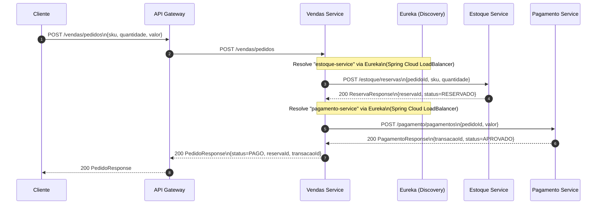
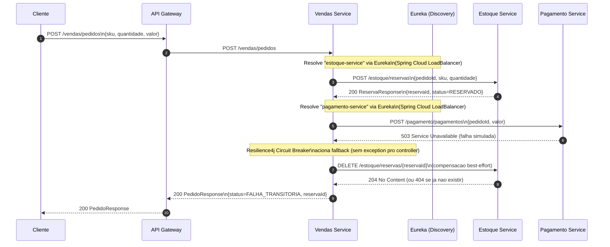

# Diagramas de Sequencia - Fluxo de Pedido

Este documento mostra o fluxo de processamento de pedido no lab (Gateway -> Vendas -> Estoque -> Pagamento).

## Caso 1: Sucesso (Pedido PAGO)

## Caso 2: Erro (Falha no Pagamento + Compensacao)

Neste caso, o `pagamento-service` devolve `503` (ou ocorre timeout). O `vendas-service` aciona o fallback do circuit breaker (retorna `FALHA_TRANSITORIA`) e tenta compensar cancelando a reserva no estoque e o frete (best-effort).

